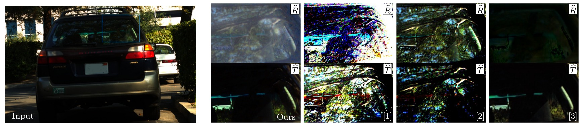

# ReflectNet: Separating Reflection and Transmission Images in the Wild
Patrick Wieschollek, Orazio Gallo, Jinwei Gu, Jan Kautz (ECCV 2018)

Abstract
-------------------
The reflections caused by common semi-reflectors, such as glass windows, can impact the performance of computer vision algorithms.
State-of-the-art methods can remove reflections on synthetic data and in controlled scenarios.
However, they are based on strong assumptions and do not generalize well to real-world images. Contrary to a common misconception, real-world images are challenging even when polarization information is used.
We present **ReflectNet**, a deep learning approach to separate the reflected and the transmitted components of the recorded irradiance that *explicitly* uses the polarization properties of light.
To train it, we introduce an accurate synthetic data generation pipeline, which simulates realistic reflections, including those generated by curved and non-ideal surfaces, non-static scenes, and high-dynamic-range scenes.

The following figure shows a common case and our estimation of the reflection and transmission images compared with state-of-the-art methods.

<p align="center">  </p>

This repository contains the source code and the model for ReflectNet, our 2018 ECCV paper "Separating Reflection and Transmission Images in the Wild." To compare against existing state-of-the-art, we also implemented several previously published methods, which may be useful to others in the research community. Specifically, in addition to our [ReflectNet](ReflectNet), we offer implementations for:

- [Polarization and statistical analysis of scenes containing a semireflector *(Schechner et al. [1])*](./other_methods/Schechner_et_al)
- [A physically-based approach to reflection separation: From physical modeling to constrained optimization *(Kong et al. [3])*](./other_methods/Kong_et_al)
- [Single Image Reflection Suppression *(Arvanitopoulos et al. [4])*](./other_methods/Arvanitopoulos_et_al)
- [Separating reflections and lighting using independent components analysis *(Farid and Adelson [5])*](./other_methods/Farid_et_al)

More Resources
-------------------

- [Project page](https://research.nvidia.com/publication/2018-09_Separating-Reflection-and)
- [Paper](https://research.nvidia.com/publication/2018-09_Separating-Reflection-and)
- [Dataset](https://drive.google.com/file/d/1eWk1DcZB9YMyPCQPsBGPlaM86y4hqon4/view?usp=sharing)


Requirements
-------------------

- OpenCV with Python bindings
- tensorpack 0.8.8 (`pip install -U git+https://github.com/ppwwyyxx/tensorpack.git --user`)
- [dcraw](https://www.cybercom.net/~dcoffin/dcraw/)
- TensorFlow >=1.3.0 (`pip install tensorflow-gpu --user`)


Performing Inference with ReflectNet
-------------------

Download the [data](https://drive.google.com/file/d/1eWk1DcZB9YMyPCQPsBGPlaM86y4hqon4/view?usp=sharing) and run

```console
user@host $ cd ReflectNet && ./run_example.sh
```

Citation
-------------------
If you use the code in this repository or the [dataset](https://drive.google.com/file/d/1eWk1DcZB9YMyPCQPsBGPlaM86y4hqon4/view?usp=sharing), please cite our paper:
```
@inproceedings{eccv2018/Wieschollek,
  author    = {Patrick Wieschollek and
               Orazio Gallo and
               Jinwei Gu and
               Jan Kautz
               },
  title     = {Separating Reflection and Transmission Images in the Wild},
  booktitle = {European Conference on Computer Vision (ECCV)},
  month     = {September},
  year      = {2018}
}
```


References
-------------------

[1] Schechner, Y.Y., Shamir, J., Kiryati, N., "Polarization and statistical analysis of scenes containing a semireflector," Journal of the Optical Society of America, 2000.<br/>
[2] Kong, N., Tai, Y.W., Shin, J.S., "A physically-based approach to reflection separation: From physical modeling to constrained optimization,"
IEEE TPAMI, 2014.<br/>
[3] Fan, Q., Yang, J., Hua, G., Chen, B., Wipf, D., "A generic deep architecture for single image reflection removal and image smoothing," IEEE ICCV, 2017.<br/>
[4] Arvanitopoulos Darginis, N., Achanta, R., Süsstrunk, S., "Single image reflection suppression," IEEE CVPR, 2017.<br/>
[5] Farid, H., Adelson, E.H., "Separating reflections and lighting using independent components analysis," IEEE CVPR, 1999.<br/>
